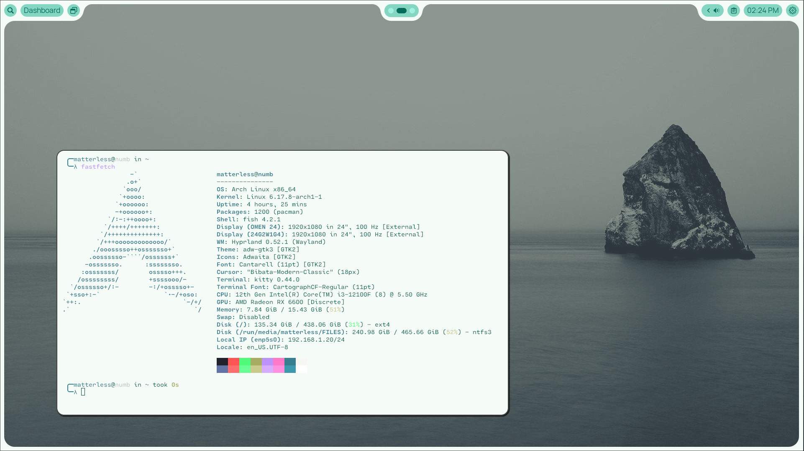
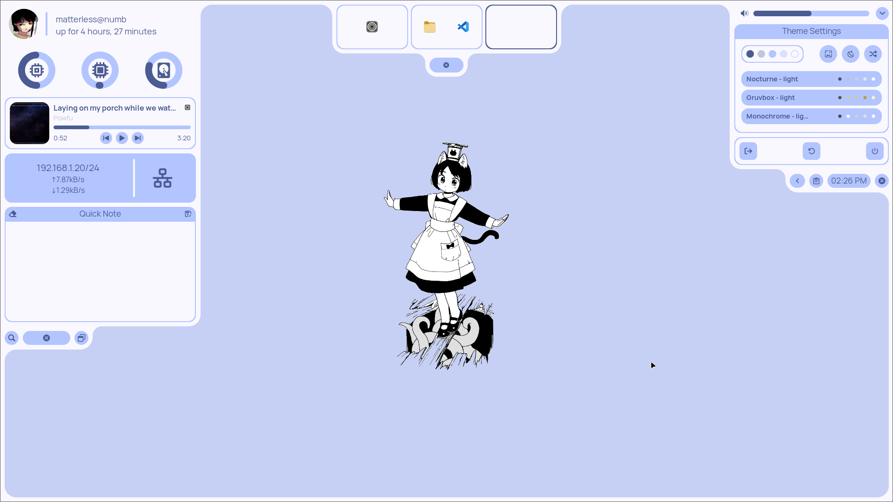

# MyArch

My own Arch Linux Desktop/configuration from scratch using [AGS/Astal](https://aylur.github.io/astal/) and [Hyprland](https://hyprland.org/).

## Overview

This configuration creates a top bar split into three main components (Left, Center, Right) and several pop-up windows for things like an App Launcher, Dashboard, and Notification Center. The entire setup is highly themeable and is designed to have its color scheme dynamically generated from the current wallpaper.

## Dependencies

- [AGS/Astal](https://aylur.github.io/astal/)
- [Hyprland](https://hyprland.org/)
- [Matugen](https://github.com/InioX/matugen)
- [YAD](https://github.com/v1cont/yad)
- [Fish](https://fishshell.com/)
- [Starship](https://starship.rs/)
- [Kitty](https://sw.kovidgoyal.net/kitty/)

## Video Demo

##

This design was inspired by the work of [@Failedex](https://github.com/Failedex).